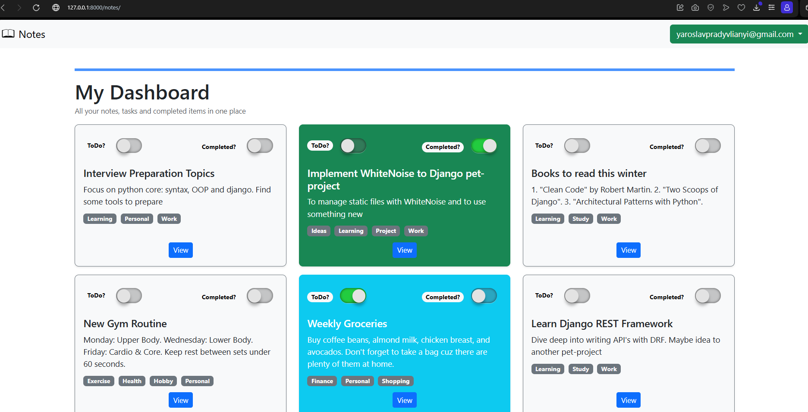
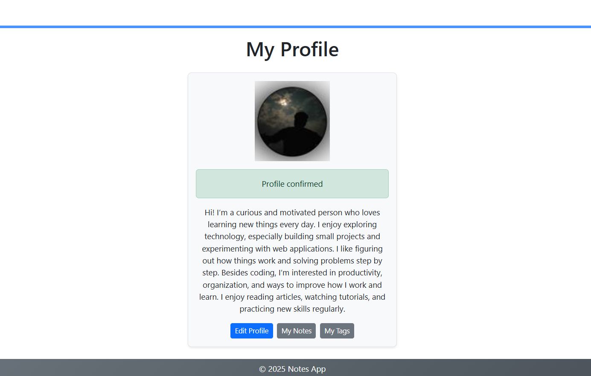
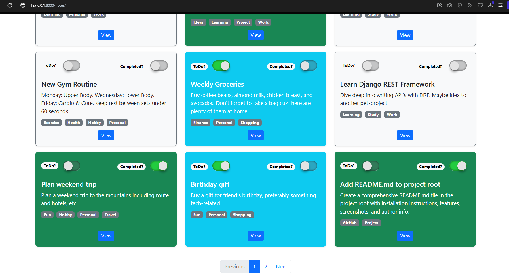

# 📝 Smart Notes App

## 📖 Description
**Smart Notes App** is a web application built with Django designed for efficient note management. 
It goes beyond simple text by offering **ToDo modes, deadline tracking, and automated email reminders**.

## 🛠 Technologies
- **Backend:** Python 3.12, Django 5.2
- **Frontend:** HTML5, CSS3, **Bootstrap 5**
- **Database:** PostgreSQL
- **Task Queue:** Redis (Broker), Celery, Celery Beat
- **Static Files:** WhiteNoise
- **Testing:** pytest
- **Deployment:** Docker & Docker Compose

## 🚀 Features
- **User Management:** Secure registration, authentication, and customizable profiles with avatars and bios.
- **Smart Notes:** Create, edit, and organize notes with a tagging system.
- **Task Management:** Toggle notes into ToDo mode, set deadlines, and track status (Active, Completed, or Expired).
- **Media Support:** Profile picture uploads managed via Django's media system.
- **Background Tasks:** 
    * Email confirmation to activate profile
    * Password reset functionality
    * Deadline Reminders: Email alerts for upcoming tasks via Celery Beat
- **Reliability:** Core functionality (`users_app`) is covered by Unit Tests (`pytest`)

## 🖼 Screenshots




## ⚙️ Installation & Setup
1. **Prerequisites:** Python 3.12+, Docker
2. **Clone the repo:**
   ```bash
   git clone https://github.com/pradivliany/smart-notes-app
   cd smart-notes-app
   ```
3. Create .env file from .env.example
4. Build and run containers:
   ```bash
   docker-compose build
   docker-compose up -d
   ```
5. Run tests:
    ```bash
   docker-compose exec -it web bash
   poetry install --with dev --no-root
   poetry run pytest -rP
   ```
6. Access the App: Open your browser and navigate to http://127.0.0.1:8000

## 👤 Author: 
   - GitHub: https://github.com/pradivliany
   - Email: yaroslavpradyvlianyi@gmail.com
